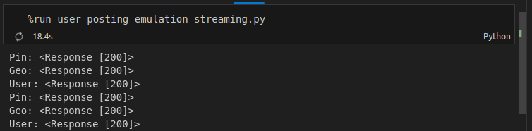
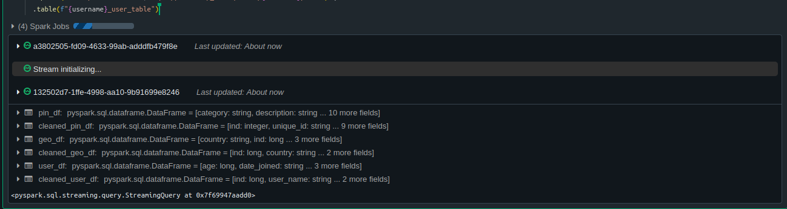

## Pinterest Data Pipeline Project

### Project Description

The aim of this project is to use various AWS resources to create a functional data pipeline for ETL of three parallel streams of sample data with specified schemas. IThis is achieved by initially batch-loading the data into an S3 bucket, from where it is extracted into Databricks and processed as neededed using PySpark. The data is then processed further using Spark to pull specific meaningful insights.


### File Structure

`aws_db_creds.yaml` : This will need to be created by the user, and should contain credentials in the following JSON format:
```
{
'HOST' : "<host>",
'USER' : '<username>',
'PASSWORD' : '<password>',
'DATABASE' : '<database>',
'PORT' : <port>
}
```

`db_creds.yaml` : This will also need to be created by the user, and should be used to store account credentials provided by AWS in the following JSON format:
```
AWS IAM Username: <username>
SSH Keypair ID: <ssh-keypair-id>
```

`user_posting_emulation.py` : A provided py file that, when run, connects to a SQL database and outputs pin, geo and user data continuously until it is stopped. This has been modified to send data to an S3 bucket and output the API response rather than print the records.

`databricks-code.ipynb` : Working code snippets from Databricks for importing data from S3 into separate Dataframes, cleaning the data and performing the specified queries.

`user-posting-emulation-streaming.py` : A modified version of 
`user-posting-emulation.py`, which sends the data to Kinesis instead of an S3 bucket.

`databricks-streaming-code.ipynb` : More working code snippets from Databricks, similar to `databricks-code.ipynb`; except instead of batch-loading, it's written to continuously read in data from Kinesis and subsequently write that data to a Delta table before transforming it as required.

`12885f560a0b_dag.py` : A Python DAG that may be uploaded to Airflow to run the Databricks batch loading notebook every 24 hours.

### Usage Instructions
#### Prerequisites
- Create a directory on your client machine

    `mkdir Pinterest-Data-Pipeline-Project`
- Create the `aws_db_creds.yaml` & `db_creds.yaml` files as specified in 'File Structure'

In order for everything to run smoothly, you should have the following (if you dont already, there are brief how-to guides in the wiki for creating most of these):

- An AWS account
- A .pem keypair file (see [Creating a Keypair file & Connecting to an EC2 Instance](https://github.com/Champney/Pinterest-Data-Pipeline-Project/wiki/EC2:-Creating-a-Key-Pair-(.pem)-file-&-Connecting-to-an-EC2-Instance))
- An IAM authenticated MSK cluster
- An EC2 client machine with Kafka installed (see [Setting up Kafka & Configuring for AWS IAM cluster authentication](https://github.com/Champney/Pinterest-Data-Pipeline-Project/wiki/EC2:-Setting-up-Kafka-&-Configuring-for-AWS-IAM-cluster-authentication))
- A Custom MSK plugin (see [Creating a Custom MSK plugin](https://github.com/Champney/Pinterest-Data-Pipeline-Project/wiki/Creating-a-Custom-MSK-plugin))
- An MSK connector for automatic saving to S3 from the MSK cluster (see [Creating an MSK connector](https://github.com/Champney/Pinterest-Data-Pipeline-Project/wiki/Creating-an-MSK-connector#creating-an-msk-connector))
- An API with a proxy integration method(see [Creating an API with Kafka REST proxy integration method](https://github.com/Champney/Pinterest-Data-Pipeline-Project/wiki/API-Gateway:-Creating-an-API-with-Kafka-REST-proxy-integration-method))
- A Databricks workspace
- IAM roles with relevant access

With the necessary prerequisites in place, the user should deploy the latest version of their API and start the proxy.

Now; from the command line, the user can simply execute either of the following python files:

#### Option 1: Batch Loading through an S3 bucket

- In the relevant directory, from the command line, execute:
    ```
    python3 user_posting_emulation.py
    ``` 
    - _(or alternatively run `run %user_posting_emulation.py` from a Jupyter notebook)_
    
    to batch load via S3. Data will be uploaded to the bucket until the process is manually stopped or encounters an error.

   


- In your Databricks workspace, execute the entire `databricks-code-ipynb` notebook. This will perform the necessary cleaning transformations on the data before calculating insights as required. The dataframes are stored as objects in the notebook.

    _Note: This databricks notebook may be executed regularly & automatically by uploading the associated DAG py file (12885f560a0b_dag.py) to Airflow. The `username`, `databricks_notebook_path` and `databricks_cluster_id` variables at the beginning of the file can be modified if the user intends on accessing a different notebook under a different account._


#### Option 2: Continuous Streaming through Kinesis

- From the command line, execute 
    ```
   python3 user_posting_emulation_streaming.py
    ``` 
    - _(or alternatively run `run %user_posting_emulation_streaming.py` from a Jupyter notebook)_

    to stream continuously through Kinesis
- In your Databricks workspace, execute the entire `databricks-streaming-notebook.ipynb` notebook. If running correctly, data will appear in Delta tables in your 'Data' or 'Catalog' tab in Databricks, this will run continuously until the process is stopped manually or encounters an error. The *py file* on the command line __and__ the *ipynb notebook* on Databricks **must both be running at the same time** or the stream will be interrupted.






### License Information

Copyright (c) 2024 David Champney

Permission is hereby granted, free of charge, to any person obtaining a copy of this software and associated documentation files (the "Software"), to deal in the Software without restriction, including without limitation the rights to use, copy, modify, merge, publish, distribute, sublicense, and/or sell copies of the Software, and to permit persons to whom the Software is furnished to do so, subject to the following conditions:

The above copyright notice and this permission notice shall be included in all copies or substantial portions of the Software.

THE SOFTWARE IS PROVIDED "AS IS", WITHOUT WARRANTY OF ANY KIND, EXPRESS OR IMPLIED, INCLUDING BUT NOT LIMITED TO THE WARRANTIES OF MERCHANTABILITY, FITNESS FOR A PARTICULAR PURPOSE AND NONINFRINGEMENT. IN NO EVENT SHALL THE AUTHORS OR COPYRIGHT HOLDERS BE LIABLE FOR ANY CLAIM, DAMAGES OR OTHER LIABILITY, WHETHER IN AN ACTION OF CONTRACT, TORT OR OTHERWISE, ARISING FROM, OUT OF OR IN CONNECTION WITH THE SOFTWARE OR THE USE OR OTHER DEALINGS IN THE SOFTWARE

